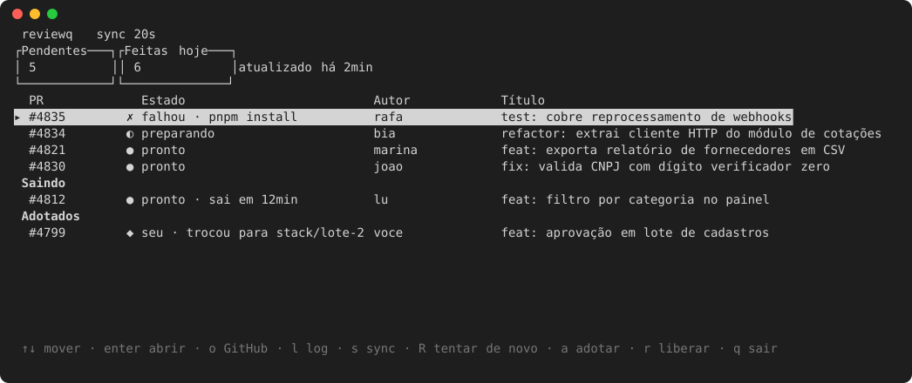

# herdr-reviewq



A macOS daemon that turns your GitHub review queue into ready-to-use [herdr](https://herdr.dev) workspaces.

When someone requests your review on a pull request, reviewq creates a git worktree for the PR, opens it as a herdr workspace and runs the repo's setup commands (`mise install`, `bundle install`, `pnpm install`, and so on). You get a notification when the worktree is ready. Once the PR leaves your queue (you reviewed it, or it was closed or merged), reviewq waits for a grace period and then removes the worktree, but only if you never touched it.

A herdr plugin adds a panel that shows your pending reviews, the state of each worktree and how many reviews you did today.

> The panel and messages are currently in Portuguese.

## How it works

- **What it tracks.** Pull requests where your review was requested directly. It ignores PRs from forks and requests made only to a team you belong to.
- **Polling.** The daemon checks GitHub through the `gh` CLI every `poll_interval_secs` (60 s by default).
- **New request.** It creates a worktree on the PR's branch, opens a herdr workspace for it and runs the setup steps. Each step has its own timeout, and the output is saved to a redacted per-PR log.
- **New commits.** When the PR gets new commits, it updates the worktree with `git reset --keep`, which refuses to overwrite local changes.
- **PR leaves your queue.** It waits `remove_grace_secs` (15 min by default), then removes the worktree and the local branch it created. If the review is requested again later, the worktree comes back.
- **Your own work is safe.** If you commit, switch branches or edit files in a worktree, reviewq leaves it in place and shows an alert in `status`. Worktrees you moved to another branch are marked as *adopted*. You can also adopt a worktree yourself before you start working in it. Adopted worktrees are never removed automatically.

## Requirements

- macOS (the daemon runs as a launchd LaunchAgent)
- [herdr](https://herdr.dev) 0.9.3 or newer
- The [GitHub CLI](https://cli.github.com), authenticated: `gh auth login`, then `gh auth setup-git`
- Rust and cargo, to build the binary
- A local clone of every repo you review
- Whatever your setup commands need, for example [mise](https://mise.jdx.dev)

## Install

1. Create the config:

   ```sh
   mkdir -p ~/.config/herdr-reviewq
   cp config.example.toml ~/.config/herdr-reviewq/config.toml
   ```

   In `[[repos]]`, set each repo's `name` (`owner/repo`), the `path` to your local clone and its `setup` commands.

   In `disposable_ignored`, list the ignored paths your setup creates (such as `node_modules` or `vendor/bundle`). These are the only ignored files reviewq may delete along with a worktree.

   Unknown config keys are an error.

2. Build and install the daemon:

   ```sh
   cargo build --release
   ./target/release/herdr-reviewq service install
   ```

   This copies the binary to `~/.local/bin/herdr-reviewq` and registers and starts the LaunchAgent.

3. Link the herdr plugin. You only need to do this once, and it takes effect immediately, with no reload:

   ```sh
   herdr plugin link /path/to/herdr-reviewq
   ```

   The link points at your working tree. If you check out a branch that lacks `herdr-plugin.toml` or `bin/herdr-reviewq`, the panel and actions break. Run `herdr plugin link` again after switching back.

To update, pull and repeat step 2. A panel that is already open keeps running the old binary until you close its pane and open the panel again.

## The panel

The daemon opens a `reviewq` workspace with the panel every time it starts. herdr actions are available for keyboard shortcuts:

| Action | Command | What it does |
|---|---|---|
| `open` | `herdr-reviewq ui open` | Opens the panel, or recreates it if you closed it |
| `first-ready` | `herdr-reviewq focus first-ready` | Jumps to the oldest PR that is ready for review |
| `sync-now` | `herdr-reviewq request sync` | Checks GitHub right away |

Quitting the panel (`q`) closes its pane, because the pane ends with its command. The panel always runs the binary installed in `~/.local/bin`. Panel start, exit (key or signal) and errors are logged to `~/.local/state/herdr-reviewq/logs/tui.log`.

### Keys

| Key | Action |
|---|---|
| `↑` `↓` / `k` `j` | Move the selection |
| `enter` | Open the PR's workspace (recreated if it was closed) |
| `o` | Open the PR in the browser on the daemon's machine, and copy the URL through OSC 52 (handy over a remote session) |
| `l` | Open the PR's setup log |
| `s` | Sync now |
| `R` | Retry (managed PRs only, when setup failed or the worktree is missing) |
| `a` | Adopt the worktree (asks for `y`/`n`) |
| `r` | Release an adopted worktree (asks for `y`/`n`) |
| `q` / `esc` / `ctrl+c` | Quit |

## Command line

| Command | What it does |
|---|---|
| `herdr-reviewq status` | Pending, ready and adopted PRs, today's count and alerts |
| `herdr-reviewq request sync` | Check GitHub now |
| `herdr-reviewq request retry --pr owner/repo#123` | Rerun a failed setup, or recreate a missing worktree (managed worktrees only) |
| `herdr-reviewq request adopt --pr owner/repo#123` | Mark a worktree as yours before you work in it |
| `herdr-reviewq request release --pr owner/repo#123` | Hand an adopted worktree back. Only works if it is clean and everything is pushed. |
| `herdr-reviewq service restart` | Restart the daemon, for example after editing the config |
| `herdr-reviewq service uninstall` | Remove the LaunchAgent |

Logs live in `~/.local/state/herdr-reviewq/`: `daemon.log`, plus one redacted setup log per PR under `logs/`.

## Safety guarantees

- **Only pristine worktrees are removed, and only after the grace period.** Pristine means:
  - same branch and commit that reviewq checked out;
  - no tracked changes and no new files;
  - no ignored files outside `disposable_ignored`.
- **No destructive git commands.** reviewq never runs `reset --hard`, `clean` or `--force`. Updates use `reset --keep`.
- **Local branches are deleted only when reviewq created them**, they still point at reviewq's commit and no other worktree has them checked out.
- **Backups before changes.** Before any reset or removal, the previous commit is saved under `refs/reviewq/backup/pr-<n>/<timestamp>` and kept for 14 days.
- **Failures fail safe.** A failed GitHub query never removes anything, and a failure to save state stops the cycle.
- **Diffs match GitHub's.** reviewq fetches the PR's base branch (`baseRefName`; for a stacked PR, the branch of the PR below it) into `origin/<base>` when it creates the worktree, on every push by the author and whenever GitHub retargets the PR. Local branches, like the clone's `main`, are never touched, so compare against `origin/<base>`, not `main`.
- **reviewr opens on the right base.** In each worktree, the base is stored as the reviewr base pick (plugin `persiyanov.reviewr`, ref `refs/worktree/reviewr/base-pick`). A base you pick yourself with `B` is never overwritten.
